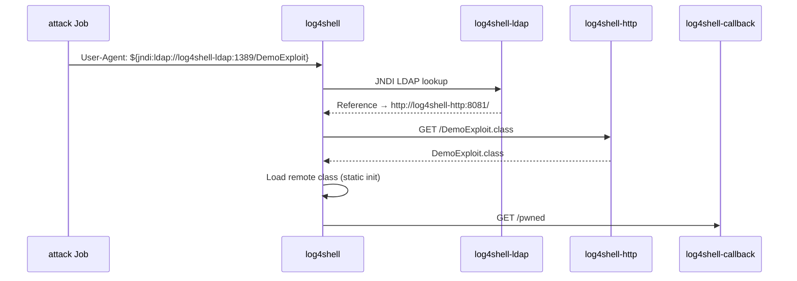

# Java Log4Shell (CVE-2021-44228)

Intentionally vulnerable Spring Boot app using **log4j-core 2.14.1**. User-controlled HTTP input is logged without sanitization, reproducing the full Log4Shell JNDI → LDAP → HTTP class-load chain.

## The vulnerability

`/api/search` queries a PostgreSQL product catalog, then logs the search terms via log4j2:

```java
logger.info("Search request: query={} category={} userAgent={}", q, category, userAgent);
```

In log4j2 **2.14.1**, strings containing `${jndi:...}` are resolved through JNDI during log message formatting.

## Full attack chain



| Component | Role |
|-----------|------|
| `postgres` | Product catalog database |
| `log4shell` | Vulnerable app (log4j 2.14.1, `trustURLCodebase=true`) |
| `log4shell-ldap` | marshalsec LDAP server returning a malicious Reference |
| `log4shell-http` | Serves `DemoExploit.class` over HTTP |
| `log4shell-callback` | Receives outbound HTTP proving the class ran |

`DemoExploit` is harmless — it only logs and calls the callback endpoint.

## Kubernetes

```bash
make deploy
make trigger-traffic   # background legitimate search traffic
make trigger-attack    # full Log4Shell chain + verify logs
make stop-traffic
```

After `make trigger-attack`, verify the chain:

```bash
# 1. JNDI triggered, remote class loaded
kubectl logs deployment/log4shell -n java-log4shell | grep "LOG4SHELL DEMO"

# 2. Outgoing HTTP to fetch the class
kubectl logs deployment/log4shell-http -n java-log4shell | grep "DemoExploit.class"

# 3. Outgoing HTTP from loaded class
kubectl logs deployment/log4shell-callback -n java-log4shell | grep "CALLBACK HIT"
```

## Endpoints

| Path | Description |
|------|-------------|
| `GET /health` | Health check (includes DB connectivity) |
| `GET /` | App info |
| `GET /api/search?q=&category=` | Search product catalog; logs `q`, `category`, and `User-Agent` via log4j2 |

Example:

```bash
curl "http://localhost:8080/api/search?q=prometheus&category=telemetry"
```

## Versions

| Component | Version |
|-----------|---------|
| Spring Boot | 2.7.18 |
| log4j-core | **2.14.1** (vulnerable) |
| Java (runtime) | 17 |
| LDAP server | [marshalsec](https://github.com/mbechler/marshalsec) |

**Warning:** This app is deliberately vulnerable with remote class loading enabled (`trustURLCodebase=true`). Use only in isolated demo/test clusters.
